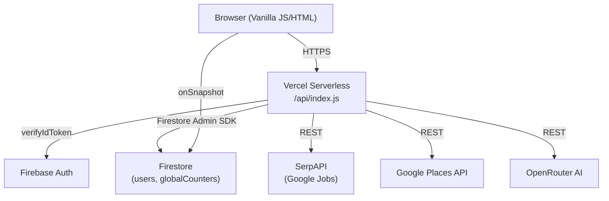

# AJOS (Automated Job Opportunity Seeker)

[](LICENSE)
[](https://automated-job-opportunity-seeker.vercel.app/)
[](https://nodejs.org)
[]()

A lightweight, secure Node.js application for automated job hunting, company lead generation, and cold outreach. AJOS finds jobs (via Google Jobs) and businesses (via Google Places), extracts verified contact information from company websites, and generates targeted cold emails using AI.

## Live Demo

Deployed on Vercel — requires an authorized account to access (21-user cap).

👉 **[Launch AJOS Live App](https://automated-job-opportunity-seeker.vercel.app/)**

---

## Features

- **Job Search** — Find job listings via Google Jobs (SerpAPI)
- **Company Lead Generation** — Search businesses by industry and location
- **Contact Scraping** — Extracts emails, phones, and social links from company websites
- **AI Email Drafts** — Generates personalized cold emails via OpenRouter
- **Secure Auth** — Firebase Auth with email verification, Turnstile bot protection, and 5-day inactivity logout
- **Usage Quotas** — Per-user monthly limits enforced server-side with Firestore transactions

---

## Architecture



**Security layers:** Helmet CSP · CORS (production origin-locked) · Firebase JWT verification · email-verified guard · per-user Firestore transactions · SSRF protection on scrape · Cloudflare Turnstile · express-rate-limit (IP) · global daily SERP cap

---

## Tech Stack

| Layer | Technology |
|-------|-----------|
| Backend | Node.js, Express 5, Firebase Admin SDK |
| Frontend | HTML5, Vanilla CSS, Vanilla JS (ES modules) |
| Auth | Firebase Authentication |
| Database | Cloud Firestore |
| Security | Helmet, express-rate-limit, Cloudflare Turnstile |
| APIs | SerpAPI · Google Places · OpenRouter |
| Hosting | Vercel (serverless) |

---

## Local Development

### 1. Clone and install

```bash
git clone <repo-url>
cd "Lead Gen Code"
npm install
```

### 2. Set up environment variables

```bash
cp .env.example .env
# Fill in all values in .env — see .env.example for documentation
```

Required variables:

| Variable | Description |
|----------|-------------|
| `PLACES_API_KEY` | Google Places API key |
| `OPENROUTER_API_KEY` | OpenRouter API key |
| `SERP_API_KEY` | SerpAPI key |
| `TURNSTILE_SECRET_KEY` | Cloudflare Turnstile secret |
| `GOOGLE_APPLICATION_CREDENTIALS` | Path to Firebase Admin SDK JSON (local dev) |
| `GOOGLE_APPLICATION_CREDENTIALS_JSON` | Full JSON string (Vercel production) |
| `SERP_DAILY_CAP` | Max daily SerpAPI calls (default: 15) |
| `NODE_ENV` | `development` locally, `production` on Vercel |
| `ALLOWED_ORIGIN` | Exact allowed origin URL (production CORS) |

### 3. Run locally

```bash
npm run dev
# Server starts at http://localhost:3000
```

---

## Deployment (Vercel)

1. Push to GitHub — Vercel auto-deploys from the linked branch
2. Set all env vars from the table above in the Vercel dashboard under **Settings → Environment Variables**
3. Set `GOOGLE_APPLICATION_CREDENTIALS_JSON` to the contents of the Firebase Admin SDK JSON (single-line, minified)
4. The CI workflow (`.github/workflows/ci.yml`) runs `npm audit` on every push to catch dependency vulnerabilities

---

## Security Notes

- `.env` and Firebase Admin SDK JSON are gitignored — never commit them
- `firestore.rules` enforces server-side data isolation — clients cannot modify their own role or limits
- All external URLs passed to the scrape endpoint are validated through SSRF protection before fetching

---

## License

This project is licensed under the [MIT License](LICENSE).
