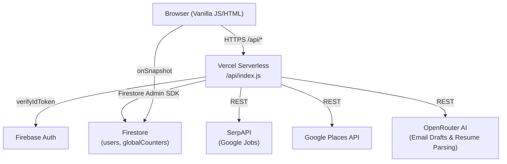

# AJOS (Automated Job Opportunity Seeker)

[](LICENSE)
[](https://automated-job-opportunity-seeker.vercel.app/)
[](https://nodejs.org)
[]()

A lightweight Node.js web application for automated job hunting, company lead generation, and cold outreach. AJOS discovers jobs (via Google Jobs) and businesses (via Google Places), extracts verified contact information from company websites, and generates targeted cold emails customized to your parsed resume.

## Live Demo

Deployed on Vercel with live capacity tracking (20-user cap):

**[Launch AJOS Live App](https://automated-job-opportunity-seeker.vercel.app/)**

---

## Features

- **Job Search**: Find listings via Google Jobs with salary, location, and direct apply links (SerpAPI).
- **Company Lead Generation**: Discover local businesses by industry and radius (Google Places API).
- **Contact Scraping**: Extracts emails, phone numbers, and social links from company websites with SSRF filtering.
- **AI Resume Parser & Profile**: Upload or paste a resume to automatically extract skills, bio, and experience (OpenRouter AI).
- **AI Cold Email Drafts**: Generates personalized outreach emails combining job details, company context, and your profile.
- **Secure Auth**: Firebase Auth (Email/Password and Google Sign-In), Turnstile bot verification, and 5-day inactivity auto-logout.
- **Usage Quotas**: Server-side monthly search limits (10 job searches, 3,000 company loads) managed with Firestore transactions.
- **Account & Privacy**: Complete self-service account deletion that purges Firestore data and Auth credentials.

---

## Architecture



**Security controls**: Helmet CSP, origin-locked CORS, Firebase JWT validation, email verification guard, SSRF prevention on web scraping, Cloudflare Turnstile bot check, rate limiting, and daily global API circuit breakers.

---

## Tech Stack

| Layer | Technology |
|---|---|
| Backend | Node.js, Express 5, Firebase Admin SDK |
| Frontend | HTML5, Vanilla CSS, Vanilla JS (ES modules) |
| Auth | Firebase Authentication |
| Database | Cloud Firestore |
| Security | Helmet, express-rate-limit, Cloudflare Turnstile |
| APIs | SerpAPI, Google Places, OpenRouter |
| Hosting | Vercel (serverless) |

---

## Local Development

### 1. Clone and install

```bash
git clone <repo-url>
cd "Lead Gen Code"
npm install
```

### 2. Set up environment variables

```bash
cp .env.example .env
# Fill in all values in .env (see .env.example)
```

Required variables:

| Variable | Description |
|---|---|
| `PLACES_API_KEY` | Google Places API key |
| `OPENROUTER_API_KEY` | OpenRouter API key |
| `SERP_API_KEY` | SerpAPI key |
| `TURNSTILE_SECRET_KEY` | Cloudflare Turnstile secret |
| `GOOGLE_APPLICATION_CREDENTIALS` | Path to Firebase Admin SDK JSON (local dev) |
| `GOOGLE_APPLICATION_CREDENTIALS_JSON` | Full JSON string (Vercel production) |
| `SERP_DAILY_CAP` | Max daily SerpAPI calls (default: 15) |
| `NODE_ENV` | `development` locally, `production` on Vercel |
| `ALLOWED_ORIGIN` | Exact allowed origin URL (production CORS) |
| `OWNER_EMAIL` | Administrator email for unrestricted development |

### 3. Run locally

```bash
npm run dev
# Server starts at http://localhost:3000
```

---

## Deployment (Vercel)

1. Push to GitHub to trigger the Vercel deployment.
2. Set all env vars from the table above in the Vercel dashboard under **Settings -> Environment Variables**.
3. Set `GOOGLE_APPLICATION_CREDENTIALS_JSON` to the contents of the Firebase Admin SDK JSON (single-line, minified).
4. The CI workflow (`.github/workflows/ci.yml`) runs `npm audit` on every push to catch dependency vulnerabilities.

---

## Security Notes

- `.env` and Firebase Admin SDK JSON are gitignored and should never be committed.
- `firestore.rules` enforces server-side data isolation (clients cannot modify their own role or limits).
- All external URLs passed to the scrape endpoint are validated through SSRF protection before fetching.

---

## License

This project is licensed under the [MIT License](LICENSE).
